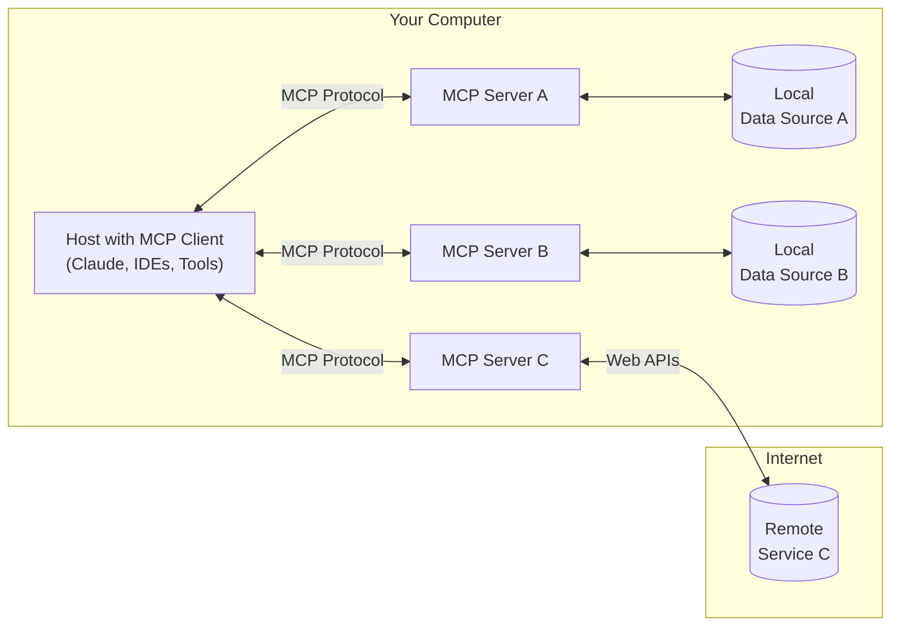
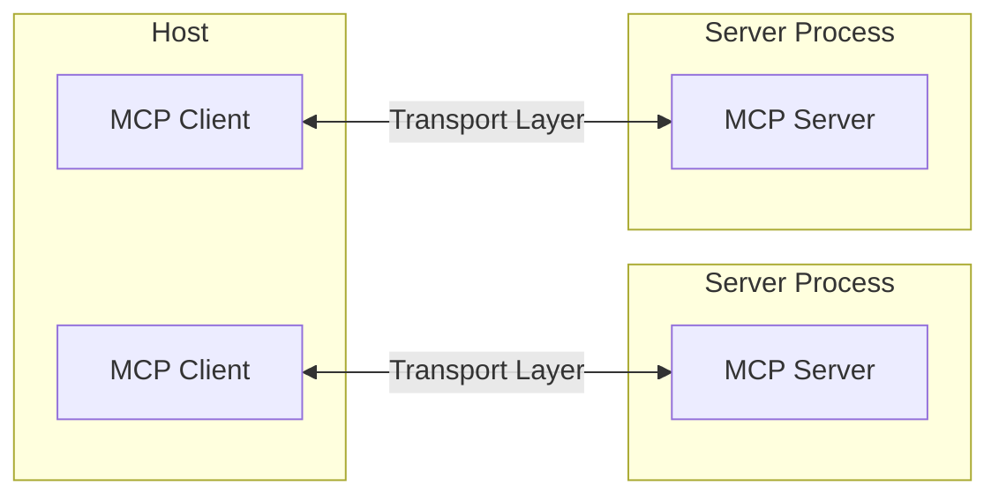
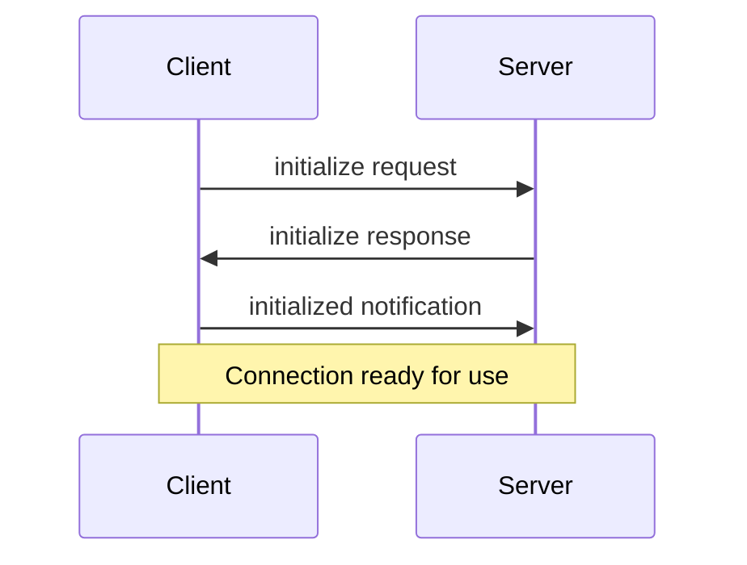

# Model Context Protocol (MCP) Documentation

## Table of Contents

- [Introduction](#introduction)
  - [Why MCP?](#why-mcp)
  - [General Architecture](#general-architecture)
- [Core Concepts](#core-concepts)
  - [Core Architecture](#core-architecture)
  - [Protocol Layer](#protocol-layer)
  - [Transport Layer](#transport-layer)
  - [Message Types](#message-types)
  - [Connection Lifecycle](#connection-lifecycle)
  - [Error Handling](#error-handling)
- [Key MCP Capabilities](#key-mcp-capabilities)
  - [Resources](#resources)
  - [Tools](#tools)
  - [Prompts](#prompts)
  - [Sampling](#sampling)
  - [Roots](#roots)
  - [Transports](#transports)
- [SDKs and Implementation](#sdks-and-implementation)
  - [Available SDKs](#available-sdks)
  - [Implementation Example - Server](#implementation-example---server)
  - [Implementation Example - Client](#implementation-example---client)
- [Debugging and Tools](#debugging-and-tools)
  - [MCP Inspector](#mcp-inspector)
  - [Debugging in Claude Desktop](#debugging-in-claude-desktop)
- [Example Servers and Implementations](#example-servers-and-implementations)
  - [Reference Implementations](#reference-implementations)
  - [Official Integrations](#official-integrations)
  - [Community Highlights](#community-highlights)
- [Building MCP with LLMs](#building-mcp-with-llms)
- [Example Clients](#example-clients)
  - [Feature Support Matrix](#feature-support-matrix)
  - [Client Details](#client-details)
- [Roadmap and Future Direction](#roadmap-and-future-direction)
- [Contributing to MCP](#contributing-to-mcp)
- [Resources](#resources)

## Introduction

MCP is an open protocol that standardizes how applications provide context to LLMs. Think of MCP like a USB-C port for AI applications. Just as USB-C provides a standardized way to connect your devices to various peripherals and accessories, MCP provides a standardized way to connect AI models to different data sources and tools.

### Why MCP?

MCP helps you build agents and complex workflows on top of LLMs. LLMs frequently need to integrate with data and tools, and MCP provides:
- A growing list of pre-built integrations that your LLM can directly plug into
- The flexibility to switch between LLM providers and vendors
- Best practices for securing your data within your infrastructure

### General Architecture

At its core, MCP follows a client-server architecture where a host application can connect to multiple servers:



- **MCP Hosts**: Programs like Claude Desktop, IDEs, or AI tools that want to access data through MCP
- **MCP Clients**: Protocol clients that maintain 1:1 connections with servers
- **MCP Servers**: Lightweight programs that each expose specific capabilities through the standardized Model Context Protocol
- **Local Data Sources**: Your computer's files, databases, and services that MCP servers can securely access
- **Remote Services**: External systems available over the internet (e.g., through APIs) that MCP servers can connect to

## Core Concepts

### Core Architecture

The Model Context Protocol (MCP) is built on a flexible, extensible architecture that enables seamless communication between LLM applications and integrations.

MCP follows a client-server architecture where:

- **Hosts** are LLM applications (like Claude Desktop or IDEs) that initiate connections
- **Clients** maintain 1:1 connections with servers, inside the host application
- **Servers** provide context, tools, and prompts to clients



### Protocol Layer

The protocol layer handles message framing, request/response linking, and high-level communication patterns.

Key classes include:

* `Protocol`
* `Client`
* `Server`

### Transport Layer

The transport layer handles the actual communication between clients and servers. MCP supports multiple transport mechanisms:

1. **Stdio transport**
   - Uses standard input/output for communication
   - Ideal for local processes

2. **HTTP with SSE transport**
   - Uses Server-Sent Events for server-to-client messages
   - HTTP POST for client-to-server messages

All transports use [JSON-RPC](https://www.jsonrpc.org/) 2.0 to exchange messages.

### Message Types

MCP has these main types of messages:

1. **Requests** expect a response from the other side:
    ```typescript
    interface Request {
      method: string;
      params?: { ... };
    }
    ```

2. **Results** are successful responses to requests:
    ```typescript
    interface Result {
      [key: string]: unknown;
    }
    ```

3. **Errors** indicate that a request failed:
    ```typescript
    interface Error {
      code: number;
      message: string;
      data?: unknown;
    }
    ```

4. **Notifications** are one-way messages that don't expect a response:
    ```typescript
    interface Notification {
      method: string;
      params?: { ... };
    }
    ```

### Connection Lifecycle

#### 1. Initialization



1. Client sends `initialize` request with protocol version and capabilities
2. Server responds with its protocol version and capabilities
3. Client sends `initialized` notification as acknowledgment
4. Normal message exchange begins

#### 2. Message Exchange

After initialization, the following patterns are supported:

- **Request-Response**: Client or server sends requests, the other responds
- **Notifications**: Either party sends one-way messages

#### 3. Termination

Either party can terminate the connection:
- Clean shutdown via `close()`
- Transport disconnection
- Error conditions

### Error Handling

MCP defines these standard error codes:

```typescript
enum ErrorCode {
  // Standard JSON-RPC error codes
  ParseError = -32700,
  InvalidRequest = -32600,
  MethodNotFound = -32601,
  InvalidParams = -32602,
  InternalError = -32603
}
```

SDKs and applications can define their own error codes above -32000.

Errors are propagated through:
- Error responses to requests
- Error events on transports
- Protocol-level error handlers

## Key MCP Capabilities

MCP servers can provide three main types of capabilities:

1. **Resources**: File-like data that can be read by clients (like API responses or file contents)
2. **Tools**: Functions that can be called by the LLM (with user approval)
3. **Prompts**: Pre-written templates that help users accomplish specific tasks

### Resources

Resources are a core primitive in the Model Context Protocol (MCP) that allow servers to expose data and content that can be read by clients and used as context for LLM interactions.

> Resources are designed to be **application-controlled**, meaning that the client application can decide how and when they should be used.
> Different MCP clients may handle resources differently. For example:
> - Claude Desktop currently requires users to explicitly select resources before they can be used
> - Other clients might automatically select resources based on heuristics
> - Some implementations may even allow the AI model itself to determine which resources to use

#### Overview

Resources represent any kind of data that an MCP server wants to make available to clients. This can include:

- File contents
- Database records
- API responses
- Live system data
- Screenshots and images
- Log files
- And more

Each resource is identified by a unique URI and can contain either text or binary data.

#### Resource URIs

Resources are identified using URIs that follow this format:

```
[protocol]://[host]/[path]
```

For example:
- `file:///home/user/documents/report.pdf`
- `postgres://database/customers/schema`
- `screen://localhost/display1`

The protocol and path structure is defined by the MCP server implementation. Servers can define their own custom URI schemes.

#### Resource Types

Resources can contain two types of content:

##### Text Resources

Text resources contain UTF-8 encoded text data. These are suitable for:
- Source code
- Configuration files
- Log files
- JSON/XML data
- Plain text

##### Binary Resources

Binary resources contain raw binary data encoded in base64. These are suitable for:
- Images
- PDFs
- Audio files
- Video files
- Other non-text formats

#### Resource Discovery

Clients can discover available resources through two main methods:

##### Direct Resources

Servers expose a list of concrete resources via the `resources/list` endpoint. Each resource includes:

```typescript
{
  uri: string;           // Unique identifier for the resource
  name: string;          // Human-readable name
  description?: string;  // Optional description
  mimeType?: string;     // Optional MIME type
}
```

##### Resource Templates

For dynamic resources, servers can expose [URI templates](https://datatracker.ietf.org/doc/html/rfc6570) that clients can use to construct valid resource URIs:

```typescript
{
  uriTemplate: string;   // URI template following RFC 6570
  name: string;          // Human-readable name for this type
  description?: string;  // Optional description
  mimeType?: string;     // Optional MIME type for all matching resources
}
```

#### Reading Resources

To read a resource, clients make a `resources/read` request with the resource URI.

The server responds with a list of resource contents:

```typescript
{
  contents: [
    {
      uri: string;        // The URI of the resource
      mimeType?: string;  // Optional MIME type

      // One of:
      text?: string;      // For text resources
      blob?: string;      // For binary resources (base64 encoded)
    }
  ]
}
```

> Servers may return multiple resources in response to one `resources/read` request. This could be used, for example, to return a list of files inside a directory when the directory is read.

#### Resource Updates

MCP supports real-time updates for resources through two mechanisms:

##### List Changes

Servers can notify clients when their list of available resources changes via the `notifications/resources/list_changed` notification.

##### Content Changes

Clients can subscribe to updates for specific resources:

1. Client sends `resources/subscribe` with resource URI
2. Server sends `notifications/resources/updated` when the resource changes
3. Client can fetch latest content with `resources/read`
4. Client can unsubscribe with `resources/unsubscribe`

### Tools

Tools are a powerful primitive in the Model Context Protocol (MCP) that enable servers to expose executable functionality to clients. Through tools, LLMs can interact with external systems, perform computations, and take actions in the real world.

> Tools are designed to be **model-controlled**, meaning that tools are exposed from servers to clients with the intention of the AI model being able to automatically invoke them (with a human in the loop to grant approval).

#### Overview

Tools in MCP allow servers to expose executable functions that can be invoked by clients and used by LLMs to perform actions. Key aspects of tools include:

- **Discovery**: Clients can list available tools through the `tools/list` endpoint
- **Invocation**: Tools are called using the `tools/call` endpoint, where servers perform the requested operation and return results
- **Flexibility**: Tools can range from simple calculations to complex API interactions

Like resources, tools are identified by unique names and can include descriptions to guide their usage. However, unlike resources, tools represent dynamic operations that can modify state or interact with external systems.

#### Tool Definition Structure

Each tool is defined with the following structure:

```typescript
{
  name: string;          // Unique identifier for the tool
  description?: string;  // Human-readable description
  inputSchema: {         // JSON Schema for the tool's parameters
    type: "object",
    properties: { ... }  // Tool-specific parameters
  }
}
```

#### Example Tool Patterns

Here are some examples of types of tools that a server could provide:

##### System Operations

Tools that interact with the local system:

```typescript
{
  name: "execute_command",
  description: "Run a shell command",
  inputSchema: {
    type: "object",
    properties: {
      command: { type: "string" },
      args: { type: "array", items: { type: "string" } }
    }
  }
}
```

##### API Integrations

Tools that wrap external APIs:

```typescript
{
  name: "github_create_issue",
  description: "Create a GitHub issue",
  inputSchema: {
    type: "object",
    properties: {
      title: { type: "string" },
      body: { type: "string" },
      labels: { type: "array", items: { type: "string" } }
    }
  }
}
```

##### Data Processing

Tools that transform or analyze data:

```typescript
{
  name: "analyze_csv",
  description: "Analyze a CSV file",
  inputSchema: {
    type: "object",
    properties: {
      filepath: { type: "string" },
      operations: {
        type: "array",
        items: {
          enum: ["sum", "average", "count"]
        }
      }
    }
  }
}
```

#### Error Handling

Tool errors should be reported within the result object, not as MCP protocol-level errors. This allows the LLM to see and potentially handle the error. When a tool encounters an error:

1. Set `isError` to `true` in the result
2. Include error details in the `content` array

This approach allows the LLM to see that an error occurred and potentially take corrective action or request human intervention.

### Prompts

Prompts enable servers to define reusable prompt templates and workflows that clients can easily surface to users and LLMs. They provide a powerful way to standardize and share common LLM interactions.

> Prompts are designed to be **user-controlled**, meaning they are exposed from servers to clients with the intention of the user being able to explicitly select them for use.

#### Overview

Prompts in MCP are predefined templates that can:
- Accept dynamic arguments
- Include context from resources
- Chain multiple interactions
- Guide specific workflows
- Surface as UI elements (like slash commands)

#### Prompt Structure

Each prompt is defined with:

```typescript
{
  name: string;              // Unique identifier for the prompt
  description?: string;      // Human-readable description
  arguments?: [              // Optional list of arguments
    {
      name: string;          // Argument identifier
      description?: string;  // Argument description
      required?: boolean;    // Whether argument is required
    }
  ]
}
```

#### Discovering Prompts

Clients can discover available prompts through the `prompts/list` endpoint:

```typescript
// Request
{
  method: "prompts/list"
}

// Response
{
  prompts: [
    {
      name: "analyze-code",
      description: "Analyze code for potential improvements",
      arguments: [
        {
          name: "language",
          description: "Programming language",
          required: true
        }
      ]
    }
  ]
}
```

#### Using Prompts

To use a prompt, clients make a `prompts/get` request:

```typescript
// Request
{
  method: "prompts/get",
  params: {
    name: "analyze-code",
    arguments: {
      language: "python"
    }
  }
}

// Response
{
  description: "Analyze Python code for potential improvements",
  messages: [
    {
      role: "user",
      content: {
        type: "text",
        text: "Please analyze the following Python code for potential improvements:\n\n```python\ndef calculate_sum(numbers):\n    total = 0\n    for num in numbers:\n        total = total + num\n    return total\n\nresult = calculate_sum([1, 2, 3, 4, 5])\nprint(result)\n```"
      }
    }
  ]
}
```

#### Dynamic Prompts

Prompts can be dynamic and include:

##### Embedded Resource Context

```json
{
  "name": "analyze-project",
  "description": "Analyze project logs and code",
  "arguments": [
    {
      "name": "timeframe",
      "description": "Time period to analyze logs",
      "required": true
    },
    {
      "name": "fileUri",
      "description": "URI of code file to review",
      "required": true
    }
  ]
}
```

When handling the `prompts/get` request, the server can include resource content in the response:

```json
{
  "messages": [
    {
      "role": "user",
      "content": {
        "type": "text",
        "text": "Analyze these system logs and the code file for any issues:"
      }
    },
    {
      "role": "user",
      "content": {
        "type": "resource",
        "resource": {
          "uri": "logs://recent?timeframe=1h",
          "text": "[2024-03-14 15:32:11] ERROR: Connection timeout in network.py:127\n[2024-03-14 15:32:15] WARN: Retrying connection (attempt 2/3)\n[2024-03-14 15:32:20] ERROR: Max retries exceeded",
          "mimeType": "text/plain"
        }
      }
    },
    {
      "role": "user",
      "content": {
        "type": "resource",
        "resource": {
          "uri": "file:///path/to/code.py",
          "text": "def connect_to_service(timeout=30):\n    retries = 3\n    for attempt in range(retries):\n        try:\n            return establish_connection(timeout)\n        except TimeoutError:\n            if attempt == retries - 1:\n                raise\n            time.sleep(5)\n\ndef establish_connection(timeout):\n    # Connection implementation\n    pass",
          "mimeType": "text/x-python"
        }
      }
    }
  ]
}
```

#### Updates and Changes

Servers can notify clients about prompt changes:

1. Server capability: `prompts.listChanged`
2. Notification: `notifications/prompts/list_changed`
3. Client re-fetches prompt list

### Sampling

Sampling is a powerful MCP feature that allows servers to request LLM completions through the client, enabling sophisticated agentic behaviors while maintaining security and privacy.

> This feature of MCP is not yet supported in the Claude Desktop client.

#### How Sampling Works

The sampling flow follows these steps:

1. Server sends a `sampling/createMessage` request to the client
2. Client reviews the request and can modify it
3. Client samples from an LLM
4. Client reviews the completion
5. Client returns the result to the server

This human-in-the-loop design ensures users maintain control over what the LLM sees and generates.

#### Message Format

Sampling requests use a standardized message format:

```typescript
{
  messages: [
    {
      role: "user" | "assistant",
      content: {
        type: "text" | "image",

        // For text:
        text?: string,

        // For images:
        data?: string,             // base64 encoded
        mimeType?: string
      }
    }
  ],
  modelPreferences?: {
    hints?: [{
      name?: string                // Suggested model name/family
    }],
    costPriority?: number,         // 0-1, importance of minimizing cost
    speedPriority?: number,        // 0-1, importance of low latency
    intelligencePriority?: number  // 0-1, importance of capabilities
  },
  systemPrompt?: string,
  includeContext?: "none" | "thisServer" | "allServers",
  temperature?: number,
  maxTokens: number,
  stopSequences?: string[],
  metadata?: Record<string, unknown>
}
```

#### Request Parameters

##### Messages

The `messages` array contains the conversation history to send to the LLM. Each message has:

- `role`: Either "user" or "assistant"
- `content`: The message content, which can be:
  - Text content with a `text` field
  - Image content with `data` (base64) and `mimeType` fields

##### Model Preferences

The `modelPreferences` object allows servers to specify their model selection preferences:

- `hints`: Array of model name suggestions that clients can use to select an appropriate model:
  - `name`: String that can match full or partial model names (e.g. "claude-3", "sonnet")
  - Clients may map hints to equivalent models from different providers
  - Multiple hints are evaluated in preference order

- Priority values (0-1 normalized):
  - `costPriority`: Importance of minimizing costs
  - `speedPriority`: Importance of low latency response
  - `intelligencePriority`: Importance of advanced model capabilities

Clients make the final model selection based on these preferences and their available models.

##### System Prompt

An optional `systemPrompt` field allows servers to request a specific system prompt. The client may modify or ignore this.

##### Context Inclusion

The `includeContext` parameter specifies what MCP context to include:

- `"none"`: No additional context
- `"thisServer"`: Include context from the requesting server
- `"allServers"`: Include context from all connected MCP servers

The client controls what context is actually included.

##### Sampling Parameters

Fine-tune the LLM sampling with:

- `temperature`: Controls randomness (0.0 to 1.0)
- `maxTokens`: Maximum tokens to generate
- `stopSequences`: Array of sequences that stop generation
- `metadata`: Additional provider-specific parameters

#### Response Format

The client returns a completion result:

```typescript
{
  model: string,  // Name of the model used
  stopReason?: "endTurn" | "stopSequence" | "maxTokens" | string,
  role: "user" | "assistant",
  content: {
    type: "text" | "image",
    text?: string,
    data?: string,
    mimeType?: string
  }
}
```

#### Example Request

Here's an example of requesting sampling from a client:
```json
{
  "method": "sampling/createMessage",
  "params": {
    "messages": [
      {
        "role": "user",
        "content": {
          "type": "text",
          "text": "What files are in the current directory?"
        }
      }
    ],
    "systemPrompt": "You are a helpful file system assistant.",
    "includeContext": "thisServer",
    "maxTokens": 100
  }
}
```

#### Human in the Loop Controls

Sampling is designed with human oversight in mind:

##### For Prompts

- Clients should show users the proposed prompt
- Users should be able to modify or reject prompts
- System prompts can be filtered or modified
- Context inclusion is controlled by the client

##### For Completions

- Clients should show users the completion
- Users should be able to modify or reject completions
- Clients can filter or modify completions
- Users control which model is used

### Roots

Roots are a concept in MCP that define the boundaries where servers can operate. They provide a way for clients to inform servers about relevant resources and their locations.

#### What are Roots?

A root is a URI that a client suggests a server should focus on. When a client connects to a server, it declares which roots the server should work with. While primarily used for filesystem paths, roots can be any valid URI including HTTP URLs.

For example, roots could be:

```
file:///home/user/projects/myapp
https://api.example.com/v1
```

#### Why Use Roots?

Roots serve several important purposes:

1. **Guidance**: They inform servers about relevant resources and locations
2. **Clarity**: Roots make it clear which resources are part of your workspace
3. **Organization**: Multiple roots let you work with different resources simultaneously

#### How Roots Work

When a client supports roots, it:

1. Declares the `roots` capability during connection
2. Provides a list of suggested roots to the server
3. Notifies the server when roots change (if supported)

While roots are informational and not strictly enforcing, servers should:

1. Respect the provided roots
2. Use root URIs to locate and access resources
3. Prioritize operations within root boundaries

#### Common Use Cases

Roots are commonly used to define:

- Project directories
- Repository locations
- API endpoints
- Configuration locations
- Resource boundaries

#### Example

Here's how a typical MCP client might expose roots:

```json
{
  "roots": [
    {
      "uri": "file:///home/user/projects/frontend",
      "name": "Frontend Repository"
    },
    {
      "uri": "https://api.example.com/v1",
      "name": "API Endpoint"
    }
  ]
}
```

This configuration suggests the server focus on both a local repository and an API endpoint while keeping them logically separated.

### Transports

Transports in the Model Context Protocol (MCP) provide the foundation for communication between clients and servers. A transport handles the underlying mechanics of how messages are sent and received.

#### Message Format

MCP uses [JSON-RPC](https://www.jsonrpc.org/) 2.0 as its wire format. The transport layer is responsible for converting MCP protocol messages into JSON-RPC format for transmission and converting received JSON-RPC messages back into MCP protocol messages.

There are three types of JSON-RPC messages used:

##### Requests
```typescript
{
  jsonrpc: "2.0",
  id: number | string,
  method: string,
  params?: object
}
```

##### Responses
```typescript
{
  jsonrpc: "2.0",
  id: number | string,
  result?: object,
  error?: {
    code: number,
    message: string,
    data?: unknown
  }
}
```

##### Notifications
```typescript
{
  jsonrpc: "2.0",
  method: string,
  params?: object
}
```

#### Built-in Transport Types

MCP includes two standard transport implementations:

##### Standard Input/Output (stdio)

The stdio transport enables communication through standard input and output streams. This is particularly useful for local integrations and command-line tools.

Use stdio when:
- Building command-line tools
- Implementing local integrations
- Needing simple process communication
- Working with shell scripts

##### Server-Sent Events (SSE)

SSE transport enables server-to-client streaming with HTTP POST requests for client-to-server communication.

Use SSE when:
- Only server-to-client streaming is needed
- Working with restricted networks
- Implementing simple updates

#### Custom Transports

MCP makes it easy to implement custom transports for specific needs. Any transport implementation just needs to conform to the Transport interface:

You can implement custom transports for:
- Custom network protocols
- Specialized communication channels
- Integration with existing systems
- Performance optimization

#### Best Practices

When implementing or using MCP transport:

1. Handle connection lifecycle properly
2. Implement proper error handling
3. Clean up resources on connection close
4. Use appropriate timeouts
5. Validate messages before sending
6. Log transport events for debugging
7. Implement reconnection logic when appropriate
8. Handle backpressure in message queues
9. Monitor connection health
10. Implement proper security measures

#### Security Considerations

When implementing transport:

##### Authentication and Authorization
- Implement proper authentication mechanisms
- Validate client credentials
- Use secure token handling
- Implement authorization checks

##### Data Security
- Use TLS for network transport
- Encrypt sensitive data
- Validate message integrity
- Implement message size limits
- Sanitize input data

##### Network Security
- Implement rate limiting
- Use appropriate timeouts
- Handle denial of service scenarios
- Monitor for unusual patterns
- Implement proper firewall rules

## SDKs and Implementation

To simplify MCP development, several official SDKs are available:

### Available SDKs

1. **Python SDK**
   - GitHub: [modelcontextprotocol/python-sdk](https://github.com/modelcontextprotocol/python-sdk)
   - Features FastMCP API for simplified server development
   - Comprehensive support for all MCP features

2. **TypeScript SDK**
   - GitHub: [modelcontextprotocol/typescript-sdk](https://github.com/modelcontextprotocol/typescript-sdk)
   - Provides express-like API for easy development
   - TypeScript type safety for protocol messages

3. **Java SDK**
   - GitHub: [modelcontextprotocol/java-sdk](https://github.com/modelcontextprotocol/java-sdk)
   - Developed by Spring AI at VMware Tanzu
   - Supports both synchronous and asynchronous programming paradigms
   - Spring Boot integration available

4. **Kotlin SDK**
   - GitHub: [modelcontextprotocol/kotlin-sdk](https://github.com/modelcontextprotocol/kotlin-sdk)
   - Released by JetBrains
   - Provides idiomatic Kotlin interface to MCP

### Implementation Example - Server

Here's a basic example of implementing an MCP server in Python:

```python
from mcp.server.fastmcp import FastMCP

# Initialize FastMCP server
mcp = FastMCP("example-server")

@mcp.tool()
def calculate_sum(a: int, b: int) -> int:
    """Add two numbers and return the result.

    Args:
        a: First number
        b: Second number
    """
    return a + b

@mcp.tool()
def get_weather(location: str) -> str:
    """Get the weather for a location.

    Args:
        location: City name or zip code
    """
    # In a real implementation, this would call a weather API
    return f"The weather in {location} is sunny and 72°F"

if __name__ == "__main__":
    # Run the server
    mcp.run(transport='stdio')
```

And here's a similar example in TypeScript:

```typescript
import { McpServer } from "@modelcontextprotocol/sdk/server/mcp.js";
import { StdioServerTransport } from "@modelcontextprotocol/sdk/server/stdio.js";
import { z } from "zod";

// Create server instance
const server = new McpServer({
  name: "example-server",
  version: "1.0.0",
});

// Register a tool
server.tool(
  "calculate_sum",
  "Add two numbers together",
  {
    a: z.number().describe("First number"),
    b: z.number().describe("Second number"),
  },
  async ({ a, b }) => {
    return {
      content: [
        {
          type: "text",
          text: String(a + b),
        },
      ],
    };
  },
);

// Run the server
async function main() {
  const transport = new StdioServerTransport();
  await server.connect(transport);
  console.error("Server running on stdio");
}

main().catch((error) => {
  console.error("Fatal error:", error);
  process.exit(1);
});
```

### Implementation Example - Client

Here's a basic example of implementing an MCP client in Python:

```python
import asyncio
from mcp import ClientSession, StdioServerParameters
from mcp.client.stdio import stdio_client

async def main():
    # Connect to an MCP server
    server_params = StdioServerParameters(
        command="python",
        args=["path/to/server.py"],
    )
    
    async with stdio_client(server_params) as streams:
        async with ClientSession(streams[0], streams[1]) as session:
            # Initialize the connection
            await session.initialize()
            
            # List available tools
            tools_result = await session.list_tools()
            print(f"Available tools: {[tool.name for tool in tools_result.tools]}")
            
            # Call a tool
            result = await session.call_tool("calculate_sum", {"a": 5, "b": 7})
            print(f"5 + 7 = {result.content[0].text}")

if __name__ == "__main__":
    asyncio.run(main())
```

And here's a similar client in TypeScript:

```typescript
import { Client } from "@modelcontextprotocol/sdk/client/index.js";
import { StdioClientTransport } from "@modelcontextprotocol/sdk/client/stdio.js";

async function main() {
  // Create a client
  const client = new Client({
    name: "example-client",
    version: "1.0.0",
  });
  
  // Connect to a server
  const transport = new StdioClientTransport({
    command: "node",
    args: ["path/to/server.js"],
  });
  
  await client.connect(transport);
  
  try {
    // List available tools
    const toolsResult = await client.listTools();
    console.log("Available tools:", toolsResult.tools.map(t => t.name));
    
    // Call a tool
    const result = await client.callTool({
      name: "calculate_sum",
      arguments: { a: 5, b: 7 },
    });
    
    console.log("5 + 7 =", result.content[0].text);
  } finally {
    await client.close();
  }
}

main().catch(console.error);
```

## Debugging and Tools

### MCP Inspector

The [MCP Inspector](https://github.com/modelcontextprotocol/inspector) is an interactive developer tool for testing and debugging MCP servers.

#### Installation and Basic Usage

The Inspector runs directly through `npx` without requiring installation:

```bash
npx @modelcontextprotocol/inspector <command>
```

```bash
npx @modelcontextprotocol/inspector <command> <arg1> <arg2>
```

#### Inspecting Servers from NPM or PyPi

A common way to start server packages from [NPM](https://npmjs.com) or [PyPi](https://pypi.com).

**NPM package:**
```bash
npx -y @modelcontextprotocol/inspector npx <package-name> <args>
# For example
npx -y @modelcontextprotocol/inspector npx server-postgres postgres://127.0.0.1/testdb
```

**PyPi package:**
```bash
npx @modelcontextprotocol/inspector uvx <package-name> <args>
# For example
npx @modelcontextprotocol/inspector uvx mcp-server-git --repository ~/code/mcp/servers.git
```

#### Inspecting Locally Developed Servers

To inspect servers locally developed or downloaded as a repository:

**TypeScript:**
```bash
npx @modelcontextprotocol/inspector node path/to/server/index.js args...
```

**Python:**
```bash
npx @modelcontextprotocol/inspector \
  uv \
  --directory path/to/server \
  run \
  package-name \
  args...
```

#### Features

The Inspector provides several features for interacting with your MCP server:

**Server Connection Pane**
- Allows selecting the transport for connecting to the server
- For local servers, supports customizing the command-line arguments and environment

**Resources Tab**
- Lists all available resources
- Shows resource metadata (MIME types, descriptions)
- Allows resource content inspection
- Supports subscription testing

**Prompts Tab**
- Displays available prompt templates
- Shows prompt arguments and descriptions
- Enables prompt testing with custom arguments
- Previews generated messages

**Tools Tab**
- Lists available tools
- Shows tool schemas and descriptions
- Enables tool testing with custom inputs
- Displays tool execution results

**Notifications Pane**
- Presents all logs recorded from the server
- Shows notifications received from the server

### Debugging in Claude Desktop

#### Checking Server Status

The Claude.app interface provides basic server status information:

1. Click the MCP plug icon to view:
   - Connected servers
   - Available prompts and resources

2. Click the MCP hammer icon to view:
   - Tools made available to the model

#### Viewing Logs

Review detailed MCP logs from Claude Desktop:

```bash
# Follow logs in real-time
tail -n 20 -F ~/Library/Logs/Claude/mcp*.log
```

The logs capture:
- Server connection events
- Configuration issues
- Runtime errors
- Message exchanges

#### Common Issues

**Working Directory**

When using MCP servers with Claude Desktop:

- The working directory for servers launched via `claude_desktop_config.json` may be undefined (like `/` on macOS) since Claude Desktop could be started from anywhere
- Always use absolute paths in your configuration and `.env` files to ensure reliable operation
- For testing servers directly via command line, the working directory will be where you run the command

For example in `claude_desktop_config.json`, use:
```json
{
  "command": "npx",
  "args": ["-y", "@modelcontextprotocol/server-filesystem", "/Users/username/data"]
}
```
Instead of relative paths like `./data`

**Environment Variables**

MCP servers inherit only a subset of environment variables automatically, like `USER`, `HOME`, and `PATH`.

To override the default variables or provide your own, you can specify an `env` key in `claude_desktop_config.json`:

```json
{
  "myserver": {
    "command": "mcp-server-myapp",
    "env": {
      "MYAPP_API_KEY": "some_key",
    }
  }
}
```

**Server Initialization**

Common initialization problems:

1. **Path Issues**
   - Incorrect server executable path
   - Missing required files
   - Permission problems
   - Try using an absolute path for `command`

2. **Configuration Errors**
   - Invalid JSON syntax
   - Missing required fields
   - Type mismatches

3. **Environment Problems**
   - Missing environment variables
   - Incorrect variable values
   - Permission restrictions

**Connection Problems**

When servers fail to connect:

1. Check Claude Desktop logs
2. Verify server process is running
3. Test standalone with Inspector
4. Verify protocol compatibility

## Example Servers and Implementations

MCP has a rich ecosystem of reference implementations and community servers that demonstrate various use cases.

### Reference Implementations

These official reference servers demonstrate core MCP features and SDK usage:

#### Data and File Systems
- **[Filesystem](https://github.com/modelcontextprotocol/servers/tree/main/src/filesystem)** - Secure file operations with configurable access controls
- **[PostgreSQL](https://github.com/modelcontextprotocol/servers/tree/main/src/postgres)** - Read-only database access with schema inspection capabilities
- **[SQLite](https://github.com/modelcontextprotocol/servers/tree/main/src/sqlite)** - Database interaction and business intelligence features
- **[Google Drive](https://github.com/modelcontextprotocol/servers/tree/main/src/gdrive)** - File access and search capabilities for Google Drive

#### Development Tools
- **[Git](https://github.com/modelcontextprotocol/servers/tree/main/src/git)** - Tools to read, search, and manipulate Git repositories
- **[GitHub](https://github.com/modelcontextprotocol/servers/tree/main/src/github)** - Repository management, file operations, and GitHub API integration
- **[GitLab](https://github.com/modelcontextprotocol/servers/tree/main/src/gitlab)** - GitLab API integration enabling project management
- **[Sentry](https://github.com/modelcontextprotocol/servers/tree/main/src/sentry)** - Retrieving and analyzing issues from Sentry.io

#### Web and Browser Automation
- **[Brave Search](https://github.com/modelcontextprotocol/servers/tree/main/src/brave-search)** - Web and local search using Brave's Search API
- **[Fetch](https://github.com/modelcontextprotocol/servers/tree/main/src/fetch)** - Web content fetching and conversion optimized for LLM usage
- **[Puppeteer](https://github.com/modelcontextprotocol/servers/tree/main/src/puppeteer)** - Browser automation and web scraping capabilities

#### Productivity and Communication
- **[Slack](https://github.com/modelcontextprotocol/servers/tree/main/src/slack)** - Channel management and messaging capabilities
- **[Google Maps](https://github.com/modelcontextprotocol/servers/tree/main/src/google-maps)** - Location services, directions, and place details
- **[Memory](https://github.com/modelcontextprotocol/servers/tree/main/src/memory)** - Knowledge graph-based persistent memory system

#### AI and Specialized Tools
- **[EverArt](https://github.com/modelcontextprotocol/servers/tree/main/src/everart)** - AI image generation using various models
- **[Sequential Thinking](https://github.com/modelcontextprotocol/servers/tree/main/src/sequentialthinking)** - Dynamic problem-solving through thought sequences
- **[AWS KB Retrieval](https://github.com/modelcontextprotocol/servers/tree/main/src/aws-kb-retrieval-server)** - Retrieval from AWS Knowledge Base using Bedrock Agent Runtime

### Official Integrations

These MCP servers are maintained by companies for their platforms:

- **[Axiom](https://github.com/axiomhq/mcp-server-axiom)** - Query and analyze logs, traces, and event data using natural language
- **[Browserbase](https://github.com/browserbase/mcp-server-browserbase)** - Automate browser interactions in the cloud
- **[Cloudflare](https://github.com/cloudflare/mcp-server-cloudflare)** - Deploy and manage resources on the Cloudflare developer platform
- **[E2B](https://github.com/e2b-dev/mcp-server)** - Execute code in secure cloud sandboxes
- **[Neon](https://github.com/neondatabase/mcp-server-neon)** - Interact with the Neon serverless Postgres platform
- **[Obsidian Markdown Notes](https://github.com/calclavia/mcp-obsidian)** - Read and search through Markdown notes in Obsidian vaults
- **[Qdrant](https://github.com/qdrant/mcp-server-qdrant/)** - Implement semantic memory using the Qdrant vector search engine
- **[Raygun](https://github.com/MindscapeHQ/mcp-server-raygun)** - Access crash reporting and monitoring data
- **[Search1API](https://github.com/fatwang2/search1api-mcp)** - Unified API for search, crawling, and sitemaps
- **[Stripe](https://github.com/stripe/agent-toolkit)** - Interact with the Stripe API
- **[Tinybird](https://github.com/tinybirdco/mcp-tinybird)** - Interface with the Tinybird serverless ClickHouse platform
- **[Weaviate](https://github.com/weaviate/mcp-server-weaviate)** - Enable Agentic RAG through your Weaviate collection(s)

### Community Highlights

A growing ecosystem of community-developed servers extends MCP's capabilities:

- **[Docker](https://github.com/ckreiling/mcp-server-docker)** - Manage containers, images, volumes, and networks
- **[Kubernetes](https://github.com/Flux159/mcp-server-kubernetes)** - Manage pods, deployments, and services
- **[Linear](https://github.com/jerhadf/linear-mcp-server)** - Project management and issue tracking
- **[Snowflake](https://github.com/datawiz168/mcp-snowflake-service)** - Interact with Snowflake databases
- **[Spotify](https://github.com/varunneal/spotify-mcp)** - Control Spotify playback and manage playlists
- **[Todoist](https://github.com/abhiz123/todoist-mcp-server)** - Task management integration

## Building MCP with LLMs

MCP development can be accelerated by using LLMs like Claude to help build custom servers and clients.

### Preparing Documentation

Before starting, gather the necessary documentation to help LLMs understand MCP:

1. Visit https://modelcontextprotocol.io/llms-full.txt and copy the full documentation text
2. Navigate to either the [MCP TypeScript SDK](https://github.com/modelcontextprotocol/typescript-sdk) or [Python SDK repository](https://github.com/modelcontextprotocol/python-sdk)
3. Copy the README files and other relevant documentation
4. Paste these documents into your conversation with the LLM

### Describing Your Server

Once you've provided the documentation, clearly describe to the LLM what kind of server you want to build. Be specific about:

- What resources your server will expose
- What tools it will provide
- Any prompts it should offer
- What external systems it needs to interact with

For example:
```
Build an MCP server that:
- Connects to my company's PostgreSQL database
- Exposes table schemas as resources
- Provides tools for running read-only SQL queries
- Includes prompts for common data analysis tasks
```

### Working with LLMs

When working with LLMs on MCP servers:

1. Start with the core functionality first, then iterate to add more features
2. Ask the LLM to explain any parts of the code you don't understand
3. Request modifications or improvements as needed
4. Have the LLM help you test the server and handle edge cases

LLMs can help implement all the key MCP features:

- Resource management and exposure
- Tool definitions and implementations
- Prompt templates and handlers
- Error handling and logging
- Connection and transport setup

### Best Practices

When building MCP servers with LLMs:

- Break down complex servers into smaller pieces
- Test each component thoroughly before moving on
- Keep security in mind - validate inputs and limit access appropriately
- Document your code well for future maintenance
- Follow MCP protocol specifications carefully

## Example Clients

This section provides an overview of applications that support the Model Context Protocol (MCP). Each client may support different MCP features, allowing for varying levels of integration with MCP servers.

### Feature Support Matrix

| Client                                      | Resources | Prompts | Tools | Sampling | Roots | Notes                                                                        |
|---------------------------------------------|-----------|---------|-------|----------|--------|-----------------------------------------------------------------------------|
| [Claude Desktop App][Claude]                | ✅        | ✅      | ✅    | ❌       | ❌    | Full support for all MCP features                                           |
| [5ire][5ire]                                | ❌        | ❌      | ✅    | ❌       | ❌    | Supports tools.                                                             |
| [BeeAI Framework][BeeAI Framework]          | ❌        | ❌      | ✅    | ❌       | ❌    | Supports tools in agentic workflows.                                        |
| [Cline][Cline]                              | ✅        | ❌      | ✅    | ❌       | ❌    | Supports tools and resources.                                               |
| [Continue][Continue]                        | ✅        | ✅      | ✅    | ❌       | ❌    | Full support for all MCP features                                           |
| [Cursor][Cursor]                            | ❌        | ❌      | ✅    | ❌       | ❌    | Supports tools.                                                             |
| [Emacs Mcp][Mcp.el]                         | ❌        | ❌      | ✅    | ❌       | ❌    | Supports tools in Emacs.                                                    |
| [Firebase Genkit][Genkit]                   | ⚠️        | ✅      | ✅    | ❌       | ❌    | Supports resource list and lookup through tools.                            |
| [GenAIScript][GenAIScript]                  | ❌        | ❌      | ✅    | ❌       | ❌    | Supports tools.                                                             |
| [Goose][Goose]                              | ❌        | ❌      | ✅    | ❌       | ❌    | Supports tools.                                                             |
| [LibreChat][LibreChat]                      | ❌        | ❌      | ✅    | ❌       | ❌    | Supports tools for Agents                                                   |
| [mcp-agent][mcp-agent]                      | ❌        | ❌      | ✅    | ⚠️       | ❌    | Supports tools, server connection management, and agent workflows.          |
| [oterm][oterm]                              | ❌        | ❌      | ✅    | ❌       | ❌    | Supports tools.                                                             |
| [Roo Code][Roo Code]                        | ✅        | ❌      | ✅    | ❌       | ❌    | Supports tools and resources.                                               |
| [Sourcegraph Cody][Cody]                    | ✅        | ❌      | ❌    | ❌       | ❌    | Supports resources through OpenCTX                                          |
| [Superinterface][Superinterface]            | ❌        | ❌      | ✅    | ❌       | ❌    | Supports tools                                                              |
| [TheiaAI/TheiaIDE][TheiaAI/TheiaIDE]        | ❌        | ❌      | ✅    | ❌       | ❌    | Supports tools for Agents in Theia AI and the AI-powered Theia IDE          |
| [Windsurf Editor][Windsurf]                 | ❌        | ❌      | ✅    | ❌       | ❌    | Supports tools with AI Flow for collaborative development.                  |
| [Zed][Zed]                                  | ❌        | ✅      | ❌    | ❌       | ❌    | Prompts appear as slash commands                                            |
| [SpinAI][SpinAI]                            | ❌        | ❌      | ✅    | ❌       | ❌    | Supports tools for Typescript AI Agents                                     |
| [OpenSumi][OpenSumi]                        | ❌        | ❌      | ✅    | ❌       | ❌    | Supports tools in OpenSumi                                                  |
| [Daydreams Agents][Daydreams]              | ✅        | ✅      | ✅    | ❌       | ❌    | Support for drop in Servers to Daydreams agents                             |

[Claude]: https://claude.ai/download
[Cursor]: https://cursor.com
[Zed]: https://zed.dev
[Cody]: https://sourcegraph.com/cody
[Genkit]: https://github.com/firebase/genkit
[Continue]: https://github.com/continuedev/continue
[GenAIScript]: https://microsoft.github.io/genaiscript/reference/scripts/mcp-tools/
[Cline]: https://github.com/cline/cline
[LibreChat]: https://github.com/danny-avila/LibreChat
[TheiaAI/TheiaIDE]: https://eclipsesource.com/blogs/2024/12/19/theia-ide-and-theia-ai-support-mcp/
[Superinterface]: https://superinterface.ai
[5ire]: https://github.com/nanbingxyz/5ire
[BeeAI Framework]: https://i-am-bee.github.io/beeai-framework
[mcp-agent]: https://github.com/lastmile-ai/mcp-agent
[Mcp.el]: https://github.com/lizqwerscott/mcp.el
[Roo Code]: https://roocode.com
[Goose]: https://block.github.io/goose/docs/goose-architecture/#interoperability-with-extensions
[Windsurf]: https://codeium.com/windsurf
[Daydreams]: https://github.com/daydreamsai/daydreams
[SpinAI]: https://spinai.dev
[OpenSumi]: https://github.com/opensumi/core
[oterm]: https://github.com/ggozad/oterm

### Client Details

#### Claude Desktop App
The Claude desktop application provides comprehensive support for MCP, enabling deep integration with local tools and data sources.

**Key features:**
- Full support for resources, allowing attachment of local files and data
- Support for prompt templates
- Tool integration for executing commands and scripts
- Local server connections for enhanced privacy and security

> Note: The Claude.ai web application does not currently support MCP. MCP features are only available in the desktop application.

#### Continue
[Continue](https://github.com/continuedev/continue) is an open-source AI code assistant, with built-in support for all MCP features.

**Key features**
- Type "@" to mention MCP resources
- Prompt templates surface as slash commands
- Use both built-in and MCP tools directly in chat
- Supports VS Code and JetBrains IDEs, with any LLM

#### Cursor
[Cursor](https://docs.cursor.com/advanced/model-context-protocol) is an AI code editor.

**Key Features**:
- Support for MCP tools in Cursor Composer
- Support for both STDIO and SSE

## Roadmap and Future Direction

The Model Context Protocol is rapidly evolving. Below is an overview of the priorities and future direction for the first half of 2025, though these may change significantly as the project develops.

### Remote MCP Support

Top priority is improving remote MCP connections, allowing clients to securely connect to MCP servers over the internet. Key initiatives include:

- **Authentication & Authorization**: Adding standardized auth capabilities, particularly focused on OAuth 2.0 support.

- **Service Discovery**: Defining how clients can discover and connect to remote MCP servers.

- **Stateless Operations**: Thinking about whether MCP could encompass serverless environments too, where they will need to be mostly stateless.

### Reference Implementations

To help developers build with MCP, offering documentation for:

- **Client Examples**: Comprehensive reference client implementation(s), demonstrating all protocol features
- **Protocol Drafting**: Streamlined process for proposing and incorporating new protocol features

### Distribution & Discovery

Exploring ways to make MCP servers more accessible, including:

- **Package Management**: Standardized packaging format for MCP servers
- **Installation Tools**: Simplified server installation across MCP clients
- **Sandboxing**: Improved security through server isolation
- **Server Registry**: A common directory for discovering available MCP servers

### Agent Support

Expanding MCP's capabilities for complex agentic workflows, focusing on:

- **Hierarchical Agent Systems**: Improved support for trees of agents through namespacing and topology awareness.

- **Interactive Workflows**: Better handling of user permissions and information requests across agent hierarchies, and ways to send output to users instead of models.

- **Streaming Results**: Real-time updates from long-running agent operations.

### Broader Ecosystem

Investment in:

- **Community-Led Standards Development**: Fostering a collaborative ecosystem where all AI providers can help shape MCP as an open standard through equal participation and shared governance, ensuring it meets the needs of diverse AI applications and use cases.
- **Additional Modalities**: Expanding beyond text to support audio, video, and other formats.
- **Standardization**: Considering standardization through a standardization body.

## Contributing to MCP

MCP is an open source project and welcomes contributions from the community. You can participate in several ways:

- **Code Contributions**: Submit pull requests to improve the SDKs, reference implementations, or documentation
- **Issue Reporting**: File issues for bugs or suggestions in the relevant repositories
- **Discussion Participation**: Join conversations in GitHub Discussions to shape the future of MCP
- **Server Development**: Build and share new MCP servers for different use cases
- **Spreading Awareness**: Help others learn about MCP and its benefits

All contributors must adhere to the MCP Code of Conduct.

## Resources

- [MCP Specification](https://spec.modelcontextprotocol.io/)
- [MCP Website](https://modelcontextprotocol.io/)
- [GitHub Organization](https://github.com/modelcontextprotocol)
- [Python SDK](https://github.com/modelcontextprotocol/python-sdk)
- [TypeScript SDK](https://github.com/modelcontextprotocol/typescript-sdk)
- [Java SDK](https://github.com/modelcontextprotocol/java-sdk)
- [Kotlin SDK](https://github.com/modelcontextprotocol/kotlin-sdk)
- [MCP Servers Repository](https://github.com/modelcontextprotocol/servers)
